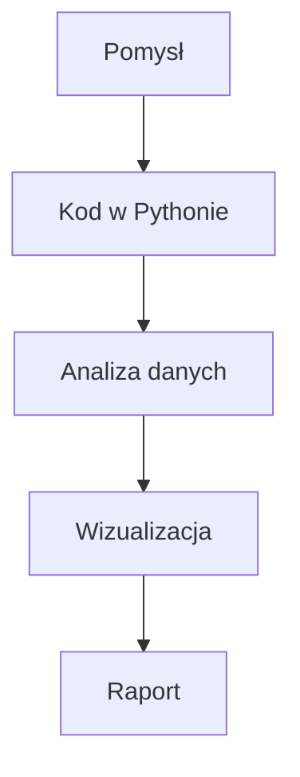

# Moje laboratorium Python II
# Imię Nazwisko
Jonasz Zolisz
## O mnie
Studiuję Analitykę danych w biznesie na Politechnice Opolskiej,
semestr 2.
## Zainteresowania
- Sport 
- Przediębiorczość
## Umiejętności techniczne
| Narzędzie | Poziom |
|-----------|--------|
| Python | początkujący 
| Excel | średni
| SQL | początkujący
## Czego chcę się nauczyć
1. programowania 
2. obsługi komputera na wyższym poziomie niż w liceum 
3. Ogólna poprawa umiejętności komputerowych 
## Kontakt
- GitHub: [twój login](https://github.com/jonaszzolisz-byte)
-Email : jonasz.zolisz@gmail.com
## Moj workflow 
